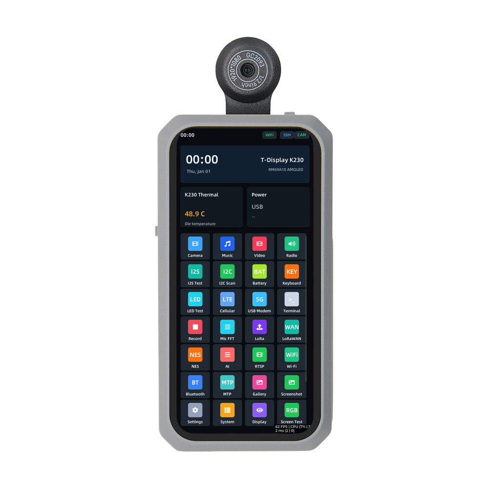

<div align="center" markdown="1">
  
</div>

<h1 align = "center">🌟 LilyGo T-Display K230 🌟</h1>

<p align="center">
  
</p>

[English](./README.MD) | [中文](./README_CN.MD)

本仓库用于从 Kendryte 官方 K230 Linux SDK 构建 LilyGo T-Display K230
的 SD 卡镜像，包含板级支持文件、LVGL 启动器应用和主机侧辅助脚本

已验证的上游 SDK：

```text
https://github.com/kendryte/k230_linux_sdk.git
dev commit 22d02c6b6783a57a3aca7eb3160e313e772cb710
```

## 功能概览

版本变更记录请看 [CHANGELOG_CN.MD](CHANGELOG_CN.MD)。

公开镜像包含手机风格 LVGL Launcher、横竖屏自适应布局、相机和多媒体应用、
系统设置、可选键盘底板外设支持、nRF52840/nRF9151 管理、LoRa/LoRaWAN
工具以及 Meshtastic Beta 功能。

功能状态：

- 日常可用应用：相机、相册、音乐、网络电台、录音、视频播放器、终端、
  MTP、Wi-Fi、以太网、显示、音频、通知、触觉反馈、电池、充电器、传感器、键盘和系统设置
- Beta 应用：Meshtastic、LoRaWAN、小智语音助手、PicoClaw、
  nRF9151 蜂窝/GNSS 数据工具、nRF52840 UART DFU
- 用户自备资源：默认镜像不内置 NES ROM 和离线地图瓦片，用户可通过 SD 卡或
  MTP 自行复制

## 目录结构

```text
k230_bsp/          U-Boot、Linux、Buildroot、DTB、启动 logo 和硬件服务 overlay
k230_launcher/     LVGL 启动器应用和随镜像打包的运行资源
k230_linux_sdk/    Kendryte 官方 K230 Linux SDK 子模块
scripts/           主机依赖安装、overlay 应用、镜像构建和 SSH 部署脚本
```

## 文档入口

- [版本变更记录](CHANGELOG_CN.MD)
- [Launcher 应用使用说明](k230_launcher/docs/APPS_CN.md)
- [离线地图瓦片下载说明](k230_launcher/docs/MAPS_CN.md)
- [BSP GPIO 和硬件连接表](k230_bsp/docs/HARDWARE_PINMAP_CN.md)
- [BSP README](k230_bsp/README_CN.MD)
- [Launcher README](k230_launcher/README_CN.MD)
- [nRF52840 固件和相关文档](https://github.com/Xinyuan-LilyGO/T-Display-K230-nRF52840)
- [nRF9151 & 键盘固件和相关文档](https://github.com/Xinyuan-LilyGO/T-Display-K230-nRF9151)

## 从全新 Ubuntu 电脑开始构建

推荐 Ubuntu 22.04 或 24.04

安装 Git 和基础构建工具：

```sh
sudo apt update
sudo apt install -y git ca-certificates build-essential make rsync python3
```

克隆本仓库并拉取 SDK 子模块：

```sh
git clone --recurse-submodules https://github.com/Xinyuan-LilyGO/T-Display-K230.git t-display-k230
cd t-display-k230
```

如果克隆时没有拉取子模块：

```sh
git submodule update --init --recursive
```

安装 SDK 工具链和主机依赖：

```sh
./scripts/setup_ubuntu.sh
```

将 BSP 和 Launcher 应用到 SDK：

```sh
./scripts/apply_to_sdk.sh
```

构建 SD 卡镜像：

```sh
./scripts/build_sdcard_image.sh
```

镜像会导出到：

```text
k230_bsp/images/sysimage-sdcard.img
```

如果需要完全干净地重新构建，先删除 SDK 输出目录，再重新应用 overlay 并构建：

```sh
rm -rf k230_linux_sdk/output
./scripts/apply_to_sdk.sh
./scripts/build_sdcard_image.sh
```

## 在 Windows 中通过 WSL2 编译

不建议在原生 Windows 的 CMD、PowerShell、Git Bash、MSYS2 或 Cygwin 中直接
编译推荐使用 WSL2 Ubuntu，这样 SDK 可以使用正常的 Linux 文件系统、权限、
软链接和 shell 环境

在管理员 PowerShell 中安装 Ubuntu 22.04：

```powershell
wsl --install -d Ubuntu-22.04
```

如果 WSL 提示需要重启 Windows，请先重启然后打开 Ubuntu 终端，安装基础工具：

```sh
sudo apt update
sudo apt install -y git ca-certificates build-essential make rsync python3
```

源码和构建目录请放在 WSL 的 Linux 文件系统内，例如 `~/work`不要放在
`/mnt/c/Users/...` 下面编译；这个路径速度较慢，也可能影响 SDK 依赖的 Linux
权限和软链接

```sh
mkdir -p ~/work
cd ~/work
git clone --recurse-submodules https://github.com/Xinyuan-LilyGO/T-Display-K230.git t-display-k230
cd t-display-k230
./scripts/setup_ubuntu.sh
./scripts/apply_to_sdk.sh
./scripts/build_sdcard_image.sh
```

生成的镜像路径是：

```text
k230_bsp/images/sysimage-sdcard.img
```

如果需要从 Windows 资源管理器打开镜像目录：

```sh
explorer.exe "$(wslpath -w k230_bsp/images)"
```

## 烧录

Linux 下将 `/dev/sdX` 替换为真实 TF 卡设备：

```sh
sudo dd if=k230_bsp/images/sysimage-sdcard.img of=/dev/sdX bs=8M status=progress conv=fsync
sync
```

macOS 下将 `diskN` 替换为真实 TF 卡设备：

```sh
diskutil unmountDisk /dev/diskN
sudo dd if=k230_bsp/images/sysimage-sdcard.img of=/dev/rdiskN bs=8m status=progress
sync
```

### Windows 使用 Rufus 烧录

1. 将 TF 卡插入 Windows 电脑
2. 下载 [Rufus](https://rufus.ie/en) 然后打开 Rufus
3. 在 `设备` 中选择 TF 卡
4. 在 `引导类型选择` 中选择 `磁盘或 ISO 镜像`，然后点击 `选择`
5. 选择 `k230_bsp/images/` 目录下的 `sysimage-sdcard.img`
6. 点击 `开始`
7. 如果 Rufus 询问写入模式，选择 `以 DD 镜像模式写入`
8. 确认清空 TF 卡的提示，等待 Rufus 写入完成
9. 安全弹出 TF 卡，然后插入 T-Display K230

烧录完成后，Windows 可能会提示格式化未知分区请取消该提示TF 卡中包含
K230 镜像使用的 Linux 分区

## SSH 快速部署

设备已经进入 Linux 且可以 SSH 连接时，可以不重新烧录 SD 卡，直接重编并部署
Launcher：

```sh
./scripts/deploy_launcher.sh 192.168.1.100
```

同时部署 Launcher 和启动文件：

```sh
./scripts/deploy_launcher.sh 192.168.1.100 --full --reboot
```

> [!IMPORTANT]
>
> 以上IP地址请替换为设备的IP地址
>

## 已包含的硬件支持

- RM69A10 AMOLED MIPI DSI 屏幕和 U-Boot 启动 logo
- GT9895 / Goodix Berlin 触摸
- GC2093 摄像头和可选 DW9714 对焦模组
- RTL8189FS SDIO Wi-Fi
- USB 蓝牙适配器支持和 BlueZ 运行环境
- nRF52840 UART 预设
- nRF9151 UART 和使能引脚预设
- SX1262/LR2021 LoRa SPI 预设
- MAX98357A 外部 I2S 功放和音频输出切换
- AHT20、BQ25896、BQ27220、XL9555、TCA8418 和可选 DRV2605 I2C 设备
- 键盘中断 GPIO42 和键盘背光 GPIO52/PWM4
- PMU 电源键 input 和 K230 温度传感器支持

`k230_bsp/images/` 下的镜像文件是本机构建产物


## 当前限制

- Meshtastic 当前作为 Beta 功能提供。核心聊天、节点显示、地图和频道分享已经可用。
  语音/图片传输仅限两端都使用 LR2021 模块的 K230 设备；SX1262 版本仅支持基础
  文字 mesh 消息。
- HDMI 目前保留为诊断功能，AMOLED 仍然是默认显示路径
- 依赖扩展硬件的功能只会在检测到对应模块后启用，包括 nRF9151、nRF52840、
  TCA8418、BQ27220、BQ25896、XL9555、DRV2605 和 AHT20
- 小智需要网络连接和兼容小智协议的服务。唤醒词监听只会在打开小智应用并占用
  麦克风时启用。
- PicoClaw 需要网络连接和 OpenAI 兼容模型 API key。
- 离线地图瓦片、NES ROM 和用户媒体文件需要用户自行复制到 SD 卡中
